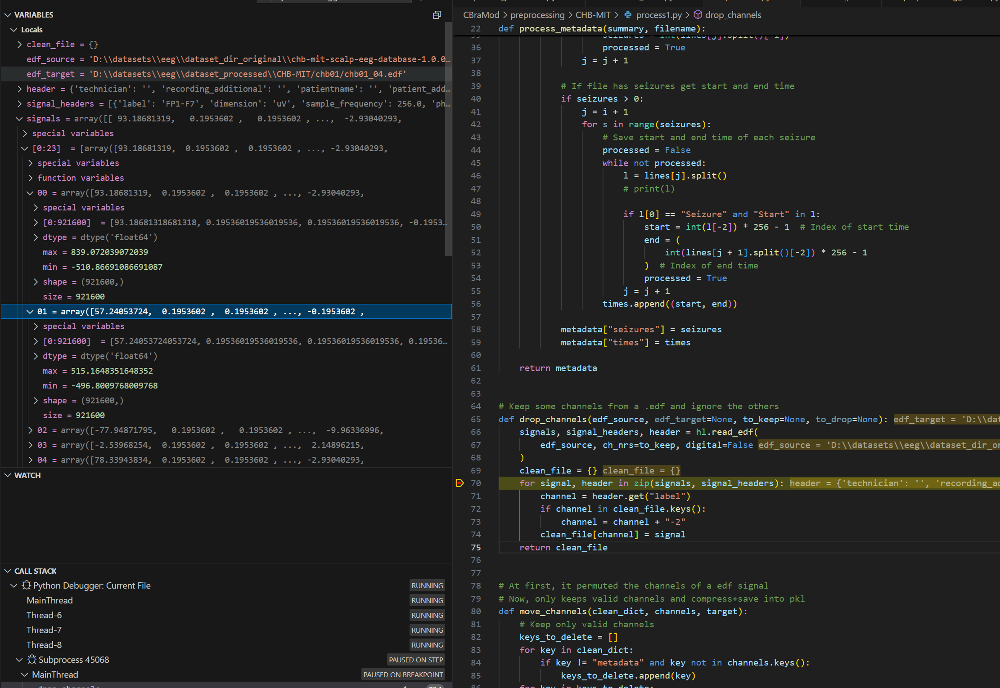
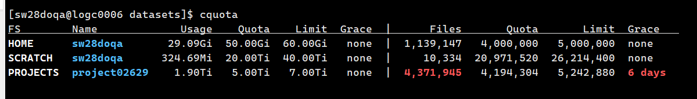
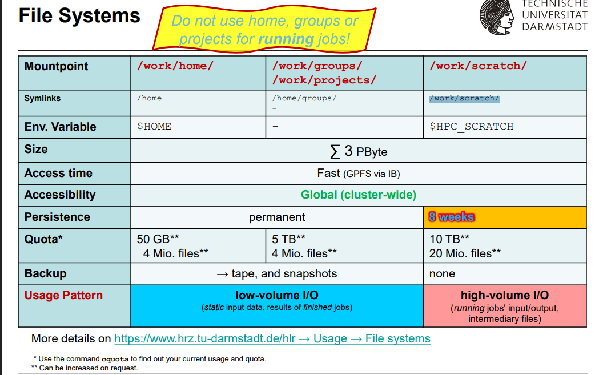

# 1. CBraMod

## 1.1. Preprocessing

### 1.1.1 CHB-MIT

#### 1.1.1.1 process1.py
读取时，signal是±1000的范围
{'label': 'T7-P7', 'dimension': 'uV', 'sample_frequency': 256.0, 'physical_max': 800.0, 'physical_min': -800.0, 'digital_max': 2047, 'digital_min': -2048, 'prefilter': '', 'transducer': ''}
保存为pkl文件时，没有对signal做修改。

#### 1.1.1.2 process2.py
将每个清洗好的数据切成10s的window。并且给每个window加上是否seizure的label。

#### 1.1.1.3 chb_dataset.py
data=[16, 2560]首先在每个通道上重采样为2000 -> [16,2000]
然后再reshape为[19, 10, 200]，然后再统一将data/100，返回data,label

### 1.1.2 wki25
wki25数据已经是x.xx的了，不用再/100，也不用缩放。已经切分好为1s一个windows，如果发作时，则以0.5s为步长，不发作时1s为步长。
**重采样**，为了保证和CBraModchb_dataset.py采样频率相同，直接重采样为200hz

# 2. 服务器相关
- conda 7.23安装的，不知道是谁装的
- cquota显示Projects文件满了，现在使用SCRATCH位置用于存储数据，8周后会被自动清除。

**\<ATTENTION\>!这里文件已经超限，6天内必须清理！**

