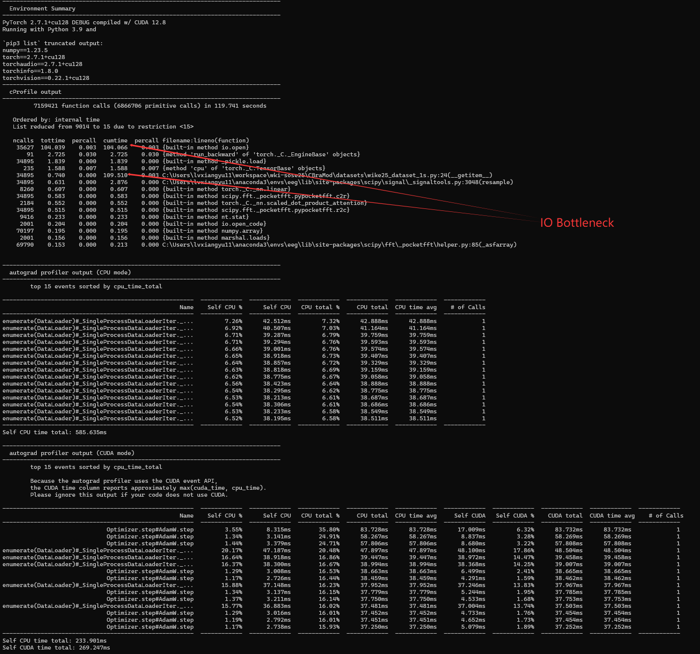
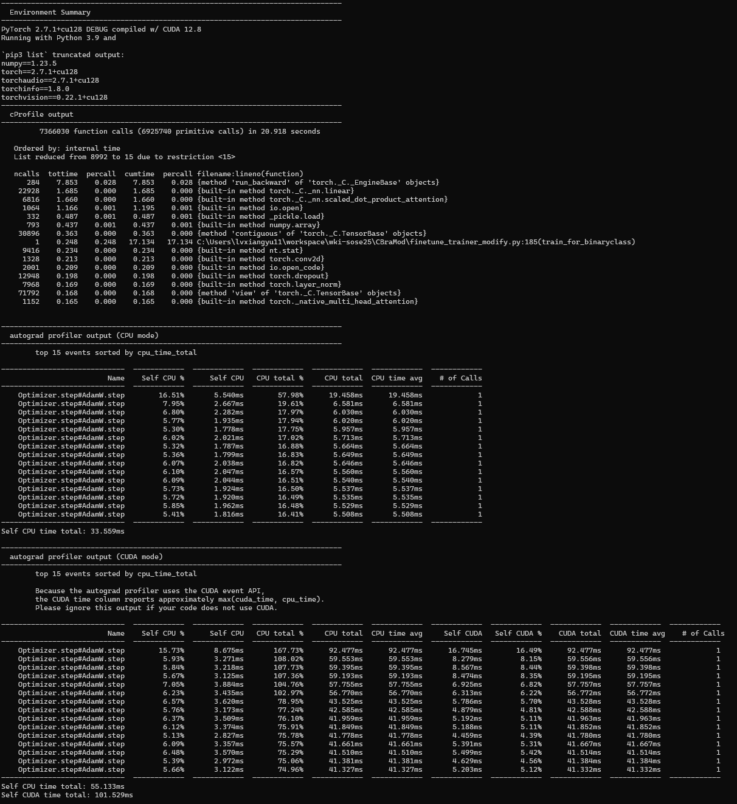

# 1. CBraMod

## 1.1. Preprocessing

### 1.1.1 CHB-MIT

#### 1.1.1.1 process1.py
读取时，signal是±1000的范围
{'label': 'T7-P7', 'dimension': 'uV', 'sample_frequency': 256.0, 'physical_max': 800.0, 'physical_min': -800.0, 'digital_max': 2047, 'digital_min': -2048, 'prefilter': '', 'transducer': ''}
保存为pkl文件时，没有对signal做修改。

#### 1.1.1.2 process2.py
将每个清洗好的数据切成10s的window。并且给每个window加上是否seizure的label。

#### 1.1.1.3 chb_dataset.py
data=[16, 2560]首先在每个通道上重采样为2000 -> [16,2000]
然后再reshape为[19, 10, 200]，然后再统一将data/100，返回data,label

### 1.1.2 wki25
~~wki25数据已经是x.xx的了，不用再/100，也不用缩放。已经切分好为1s一个windows，如果发作时，则以0.5s为步长，不发作时1s为步长。~~
wki25统计数据如下：
📊 全局统计:
----------------------------------------
总通道类型数: 19
全局最小值: -0.01 μV
全局最大值: 0.01 μV
全局范围: 0.01 μV
平均范围: 0.01 ± 0.00 μV

根据CHB-MIT的8~-8，我们需要将wki25的数据*1000 缩放到[-10, 10]的范围。

**重采样**，为了保证和CBraModchb_dataset.py采样频率相同，直接重采样为200hz

[wike25_dataset_1s.py] __getitem__函数中将reshape从 [_, 19, 10, 200] 改为 [_, 19, 1, 200] 
[model_for_wike25_1s.py] CBraMod中seq_len从30改为3，线性层从10*200输入改为1*200，需要核对。

# 2. 服务器相关
- conda 7.23安装的，不知道是谁装的
- cquota显示Projects文件满了，现在使用SCRATCH位置用于存储数据，8周后会被自动清除。

**\<ATTENTION\>!这里文件已经超限，6天内必须清理！**

# 3. 性能分析

由上可见，cuda并没有消耗很长时间，问题在于读取占用过长时间 -> 重写预处理模型，每个保存256组数据。

优化后：

样本数据：
处理 train 数据集...
处理 train 记录: 100%|█████████████████████████████████████████████████████████████████████████████████████████████████████████████████████████████████| 4970/4970 [21:07<00:00,  3.92it/s]
train 数据集正样本数量: 419785, 负样本数量: 2524653
train 数据集处理完成

处理 val 数据集...
处理 val 记录: 100%|█████████████████████████████████████████████████████████████████████████████████████████████████████████████████████████████████████| 621/621 [02:14<00:00,  4.61it/s]
val 数据集正样本数量: 50435, 负样本数量: 295938
val 数据集处理完成

处理 test 数据集...
处理 test 记录: 100%|████████████████████████████████████████████████████████████████████████████████████████████████████████████████████████████████████| 622/622 [02:01<00:00,  5.10it/s] 
test 数据集正样本数量: 68238, 负样本数量: 278000
test 数据集处理完成